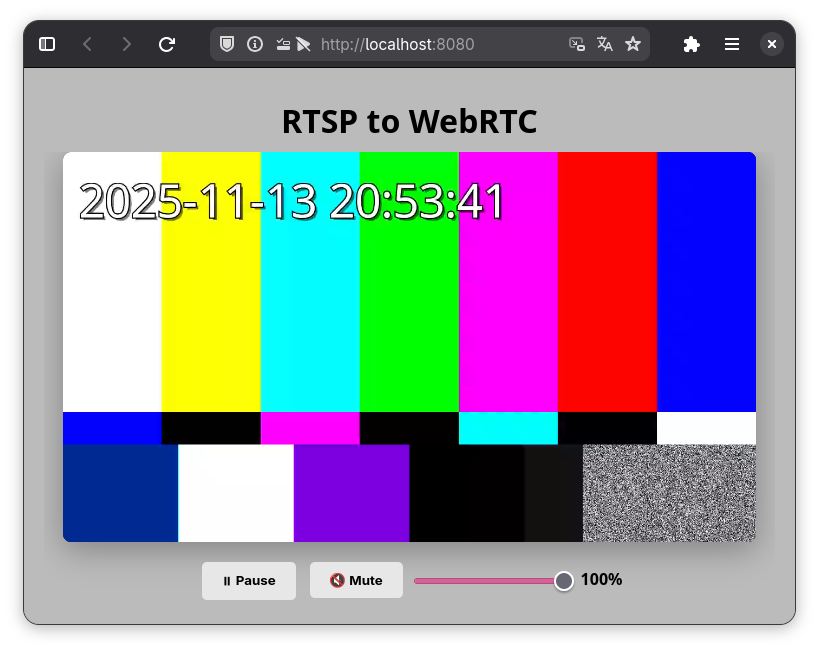

# RTSP to WebRTC Gateway

A high-performance server that converts RTSP streams to WebRTC using the WHEP (WebRTC HTTP Egress Protocol) standard.
Built with Rust for reliability and low latency.

<p align="center"></p>


## Features

- 🎥 **RTSP to WebRTC conversion** - Stream any RTSP source to web browsers
- 🎵 **Audio support** - Handles both video and audio streams (H.264/H.265 video, Opus/PCMU/PCMA audio)
- 📡 **WHEP protocol** - Standard WebRTC egress using HTTP
- 🚀 **High performance** - Asynchronous packet processing with buffering
- 🌐 **Multi-client support** - Multiple viewers can watch the same stream
- 🎨 **Web player** - Built-in HTML5 player with controls
- 🔄 **Auto-reconnect** - Automatic session cleanup on disconnect

## Architecture

The server has three main components:

1. **RTSP Client** - Connects to RTSP source and receives RTP packets
2. **Packet Processor** - Buffers and routes packets asynchronously
3. **WebRTC Server** - Serves streams to browsers via WHEP protocol

```
┌─────────────┐ RTSP/RTP ┌──────────────┐ WHEP/WebRTC ┌─────────┐
│ RTSP Camera │ ──────────────> │ Rust Server │ ────────────────> │ Browser │
└─────────────┘ └──────────────┘ └─────────┘
│
└──> Static file server (HTML player)
```

## Requirements

- Rust 1.70+ (for compilation)
- RTSP source (camera, test server, etc.)

## Quick Start

### 1. Build the server

```bash
cargo build --release
```

### 2. Run with your RTSP source

```bash
./target/release/rtsp-to-webrtc --url=rtsp://your-camera-ip:554/stream
```

### 3. Open the web player

Navigate to http://localhost:8080 in your browser

## Command Line Options

```bash
rtsp-to-webrtc [OPTIONS] --url <URL>

	Options:
	--url <URL> RTSP URL to connect to (e.g., rtsp://localhost:8554/test)
		--username <USERNAME> Username for RTSP authentication (optional)
			--password <PASSWORD> Password for RTSP authentication (requires username)
				--transport <TRANSPORT> Transport protocol: tcp or udp [default: tcp]
					--teardown <TEARDOWN> Teardown policy: auto, always, or never [default: auto]
						```

						## Development & Testing

						### Running the test RTSP server

						A GStreamer-based test server is included for development:

						```bash
						# Install GStreamer (Ubuntu/Debian)
						sudo apt-get install python3-gi gstreamer1.0-tools gstreamer1.0-plugins-base \
						gstreamer1.0-plugins-good gstreamer1.0-plugins-bad \
						gstreamer1.0-rtsp gstreamer1.0-libav

						# Install NVIDIA encoder (optional, for hardware acceleration)
						sudo apt-get install gstreamer1.0-plugins-nvenc

						# Run the test server
						python3 rtsp_test_server.py
						```

						This creates two test streams:
						- `rtsp://localhost:8554/test` - 640x480, ball pattern with ticks audio
						- `rtsp://localhost:8554/test2` - 1280x720, SMPTE pattern with sine wave audio

						Both streams include a timestamp overlay.

						### Running the gateway with test stream

						```bash
						# TCP (recommended for reliability)
						cargo run -- --url=rtsp://localhost:8554/test

						# UDP (for lower latency, may drop packets)
						cargo run -- --url=rtsp://localhost:8554/test --transport=udp
						```

						## Web Player

						The built-in web player is available at `http://localhost:8080` and includes:

						- ▶️ Play/Pause controls
						- 🔇 Mute/Unmute button
						- 🔊 Volume slider

						## API Endpoints

						### POST /whep
						Create a new WHEP session

						**Request:**
						- Content-Type: `application/sdp`
						- Body: SDP offer

						**Response:**
						- Status: 201 Created
						- Content-Type: `application/sdp`
						- Location: `/resource/{session-id}`
						- Body: SDP answer

						### DELETE /whep/resource/{id}
						Delete a WHEP session

						**Response:**
						- Status: 204 No Content (success)
						- Status: 404 Not Found (session not found)

						### GET /
						Serves the static HTML player and assets

						## Performance Optimizations

						- **Asynchronous packet processing** - RTSP reading and WebRTC writing happen in parallel
						- **Buffered channels** - 100-packet buffer prevents packet loss during temporary congestion
						- **Non-blocking writes** - Drops packets if buffer is full instead of blocking
						- **Shared tracks** - Single RTP track shared among all clients for efficiency

						## Troubleshooting

						### Video freezes or stutters
						- Try using TCP transport: `--transport=tcp`
						- Check network connectivity to RTSP source
						- Monitor logs for "buffer full" messages

						### No audio
						- Ensure RTSP source provides audio stream
						- Check supported codecs (Opus, PCMU, PCMA)
						- Verify browser autoplay policy allows audio

						### Connection fails
						- Verify RTSP URL is correct and accessible
						- Check firewall settings
						- Try with authentication if required: `--username=user --password=pass`

						## Project Structure

						```
						rtsp-to-webrtc/
						├── src/
						│ └── main.rs # Main server code
						├── static/
						│ └── index.html # Web player
						├── rtsp_test_server.py # Test RTSP server (GStreamer)
						├── Cargo.toml # Rust dependencies
						└── README.md # This file
						```

						## License

						MIT License - feel free to use in your projects!

						## Contributing

						Contributions welcome! Please open an issue or PR.

						## Acknowledgments

						- Built with [webrtc-rs](https://github.com/webrtc-rs/webrtc)
						- Uses [retina](https://github.com/scottlamb/retina) for RTSP client
						- Web player uses [whep-video-component](https://github.com/Eyevinn/whep-video-component)